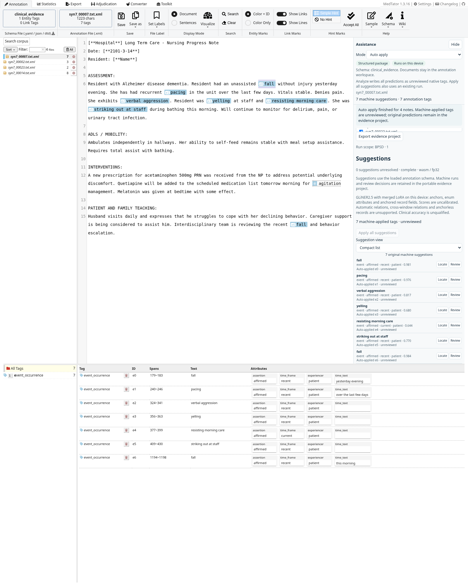
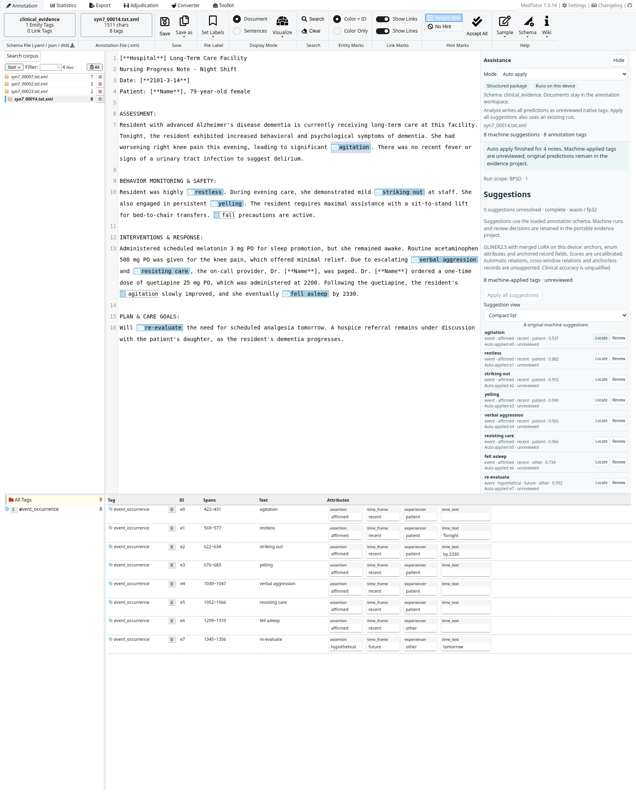
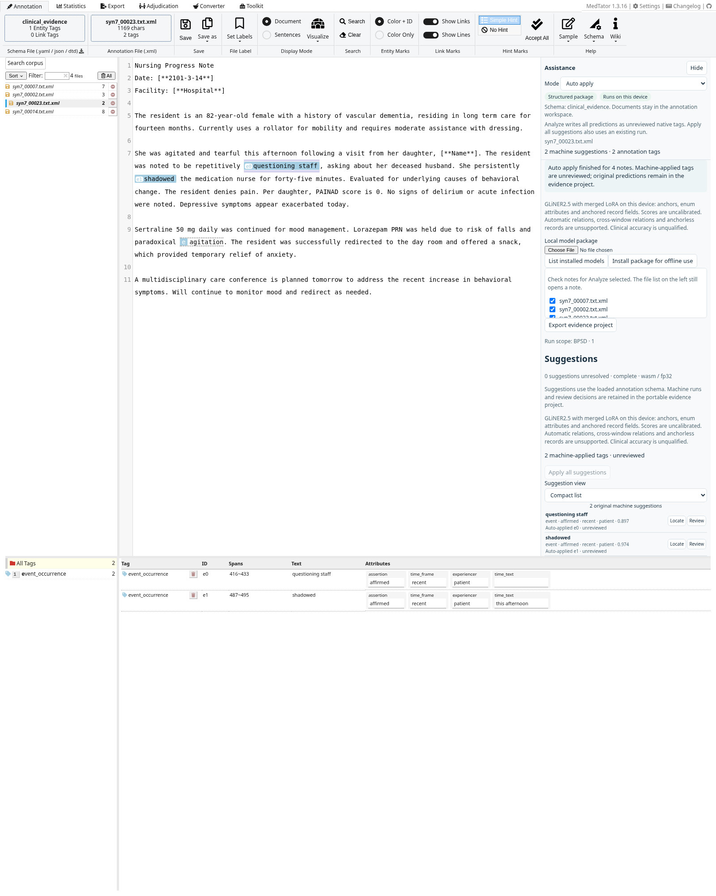

# Clinical suggestion scopes

The original MedTator assistance panel now has an opt-in **Build / edit scope** editor. The ribbon, document list, CodeMirror editor, schema controls and native annotation table remain in place. Attribute and negation-cue highlighting are outside this change.

## Build a scope

1. Load unannotated notes and open **Build / edit scope**. Use **Use clinical annotation schema**, or download the DTD and load it through MedTator's schema controls. Replacing the schema through the helper is blocked when annotation tags or evidence projects already exist. Existing tasks require a reviewed migration or a new task.
2. Choose a broad starting preset: **All clinical evidence**, **Conditions and measurements**, **Treatments and care**, or **Actions and function**. There are no disease-specific or BPSD presets.
3. Edit the scope name, definition, version, selected families and threshold. State inclusions and exclusions in the definition. Add any desired concepts with stable lowercase identifiers, a training family, a description and optional aliases/examples. Families with concepts query those targets; families without concepts query their broad clinical category. Deselect a family to omit it from future inference.
4. Inspect **Training fields and decoder support**. Field names and choice values are fixed by training; supported fields can be selected freely. The generated native annotation schema must contain every requested field. Missing fields, altered vocabularies, invalid identifiers and oversized prompts produce an error rather than silently dropping requested data.
5. Click **Apply scope**, then **Analyze note** or **Analyze selected**. Applying a scope creates a frozen, fingerprinted profile for future analysis. Existing runs retain their scope and predictions. Reapplying the same named scope records its parent hash and increments an unchanged version. **Use loaded schema** disables the scope for future runs.
6. **Auto apply** is selected by default: analyzing a note adds predictions as unreviewed native tags. Choose **Assisted** to review suggestions before applying them, or **Blind** for an independent annotation workflow. Recovered corpora retain an explicitly saved mode. Auto-applied copies retain their machine lineage. Export the scope for reuse, the training semantic schema for upstream workflows, or the evidence project for source text, predictions, native tags and provenance together.

## Adjust the suggestion threshold

**Suggestion threshold** is visible above **Analyze note** and **Analyze selected**, and beside **Analyze locally** in the evidence workspace. Move the slider from 0 to 1; its current value is displayed beside the label. Drag it or use the arrow keys (hundredths), Home (0), and End (1). The scope editor uses the same slider. Lower values retain more candidate spans; higher values are stricter. The v3 model default is 0.6. **Use default** returns to the applied scope's threshold, or the model default when no scope is active. Applying a scope clears the override so the newly applied scope controls the next run; switching an already loaded model clears the override too.

This is a threshold for extracting anchors, not a separate threshold for shared-axis attributes. Changes affect the next analysis, including Auto apply. They do not refilter an existing run, remove existing native tags, or rewrite a frozen scope. Review or reanalyze the note to use a different threshold. **Apply all suggestions** continues to apply the predictions from its existing run.

Each analysis captures one effective value for the whole batch and records `settings.threshold` and `settings.thresholdSource` (`user`, `scope`, or `model`). Failed and cancelled runs retain the same settings. The original interface displays **Run threshold** with the result; portable evidence exports retain every run's settings. The original corpus recovery also retains the override. The evidence workspace resets the override when opening another project. The slider bounds user selections to 0–1; invalid programmatic thresholds still fail before inference. The slider and mode control are disabled while analysis is running.

## Training boundary

The authority is [`na399/clinical-evidence` at `f6cadc1bb52bc8475f33d9bb0e0c072427954d92`](https://github.com/na399/clinical-evidence/tree/f6cadc1bb52bc8475f33d9bb0e0c072427954d92), specifically its registry and `annotation/corpus/contracts.py`. The pinned grammar is `clinical-evidence/0.1`, registry SHA-256 `80f255076cde0237c3f176b45545807bb237cbc57af1d983c6550a6d6816f547`. Semantic exports use `teacher-schema/0.2` and the upstream hash algorithm.

| Record family | Fixed trained anchor | Broad entity query |
|---|---|---|
| `condition_occurrence` | `condition` | `clinical_condition` |
| `measurement_occurrence` | `measure` | `clinical_measure` |
| `treatment_occurrence` | `treatment` | `clinical_treatment` |
| `event_occurrence` | `event` | `clinical_event` |
| `function_occurrence` | `activity` | `functional_activity` |
| `care_context_occurrence` | `care_context` | `care_context` |

Custom concept IDs become entity queries and map back to these canonical families. Descriptions, aliases and the task definition are passed into the encoder's actual description prompt. Record extraction continues to use the fixed trained parent/anchor names; it does not invent record types or fields. `conceptId` is separate metadata on the prediction and retained applied copy. Native span text uses the app's `concept` field alias; the exact trained anchor remains in `record.anchor`. The canonical evidence export retains concept metadata; plain legacy XML retains native family tags and attributes.

All literal evidence remains grounded in exact note spans. Enum fields accept the canonical training vocabulary or its complete export vocabulary, including `unspecified` and `not_applicable`. Empty native attribute defaults preserve abstention. Same-name fields with different family vocabularies are scored only for their applicable families, without constructing a combined attribute head.

The grammar permits more than the current ONNX decoder can return. Multi-span/list literal fields are visible but disabled. Treatment `status` has 12 export choices and exceeds the eight-choice head; it is disabled, never truncated. Relations, grammar proposals, anchorless records and the model card's separate per-anchor/hybrid decoder are not added here. The unscoped 17-choice status union remains unsupported. Requested schemas must fit the 64-query and actual 512-token prompt budgets; descriptions count toward that budget. A valid saved profile may need shorter descriptions before use with a particular package.

Profiles are saved in `extensions.suggestionScope`, legacy corpus recovery and immutable machine-run settings. Each run records the profile/hash, semantic schema hash, complete inference schema/hash and pinned registry revision/hash. The separate evidence workspace honors an imported project scope on reanalysis. Imported scopes are validated as drafts and require an explicit **Apply scope**; frozen semantic hashes are checked. No upstream schema/model access occurs during browser editing or inference.

## Model behavior and validation

Scope descriptions are model guidance, not a deterministic relevance filter or CaseDistiller classification. Family mapping is enforced; concept membership, omitted anchors and attributes still require review. The decoder uses the existing flat overlap policy within each family, so overlapping custom concepts do not guarantee multiple tags for the same occurrence.

Actual P4 ONNX was run in Chromium on two supplied generated notes, `syn7_00007` and `syn7_00021`, at threshold 0.5. The broad profile yielded 20 and 14 predictions. A manually entered **Daily care and mobility** profile, with `care_resistance` and `mobility_difficulty`, yielded 0 and 1 predictions. The latter was `transfers`; the explicit resistance in the first note was omitted. No labels were injected or corrected. This proves the configurable inference/export path, not high recall for arbitrary custom targets. These runs use different prompts and vocabularies from the earlier 27-note comparison and do not update that comparison's metrics.

The real-browser gate verifies full source coverage, exact offsets, allowed families/concept IDs, native auto-applied tag counts, unreviewed provenance, old-run immutability, evidence export and corpus recovery, with no note egress. The browser-exported semantic schema also passes upstream `SemanticSchema.model_validate(...).verify()` at the pinned revision. See [scope browser report](qualification/clinical-scope-ui.json), [upstream validation](qualification/clinical-scope-upstream-validation.json) and the accompanying original-UI screenshots.

### Current v3 BPSD support

The updated [ClinicalEvidence v3 adapter](V3-17089-VALIDATION.md) uses model-specific broad presets at threshold 0.6, verbatim core descriptions, and explicit qualified assertion/experiencer/time-frame groups. It never queries the manual administrative choices `unspecified` or `not_applicable`, and never assumes a default from an omitted attribute. Family-specific field spans and record binding remain unavailable in this decoder. Existing scopes are not silently rewritten: select a broad v3 preset or explicitly edit unsupported fields before applying an old profile. Custom definitions and concepts stay freely editable within the pinned registry; no BPSD preset was added. Existing runs retain their original model, scope and inference-schema fingerprint.

### Archived P7b BPSD screenshots

[P7b validation](P7B-VALIDATION.md) uses the same four synthetic notes, user-entered BPSD definition and threshold as the archived P4 captures below. Reproduce with `NMT_LORA_PACKAGE=/path/to/clinical-p7b.nmt-model.zip uv run --locked python tests/browser/test_lora_bpsd.py`. The active package ID is visible in the original assistance panel. The model card uses v2 attribute spans; its hybrid attribute decoder remains outside this scope workflow.

### Archived P4 user-configured BPSD screenshots

At the user's request, a custom **BPSD** profile selects `event_occurrence` and defines dementia-related behavioral/psychological symptoms, with explicit exclusions. This is a saved user configuration, not an additional built-in preset. Actual P4 inference in **Auto apply** mode on `syn7_00007`, `syn7_00002`, `syn7_00023` and `syn7_00014` produces 7, 3, 2 and 8 native tags, respectively. Every native/machine row is visible in the captures. All runs complete with exact source offsets, automatic copies remain unreviewed, and no note text leaves the app.

The screenshots also show imperfect scope adherence: two `fall` anchors in the first note, `resting` in the second, and `re-evaluate` in the dense note survive the requested exclusions. The third note captures only questioning/shadowing and omits other relevant spans. No predictions were inserted, removed or corrected for the screenshots. These are examples of prompt-guided scope behavior, not validated BPSD labels or new clinical accuracy metrics.

[Importable profile](qualification/bpsd-scope.json) · [Full capture report and predictions](qualification/bpsd-report.json) · [Scope editor](qualification/bpsd-scope-editor.png)







Reproduce after building the static app:

```sh
NMT_LORA_PACKAGE=/path/to/clinical-p4.nmt-model.zip \
  uv run --locked python tests/browser/test_clinical_scope.py
NMT_LORA_PACKAGE=/path/to/clinical-p4.nmt-model.zip \
  uv run --locked python tests/browser/test_clinical_scope_reanalysis.py

# Against a separate checkout pinned to the revision above:
uv run --no-project --with pydantic --with pyyaml \
  python scripts/verify_clinical_scope.py \
  --repo /path/to/clinical-evidence \
  --schema test-results/clinical-scope-semantic-schema.json
```
