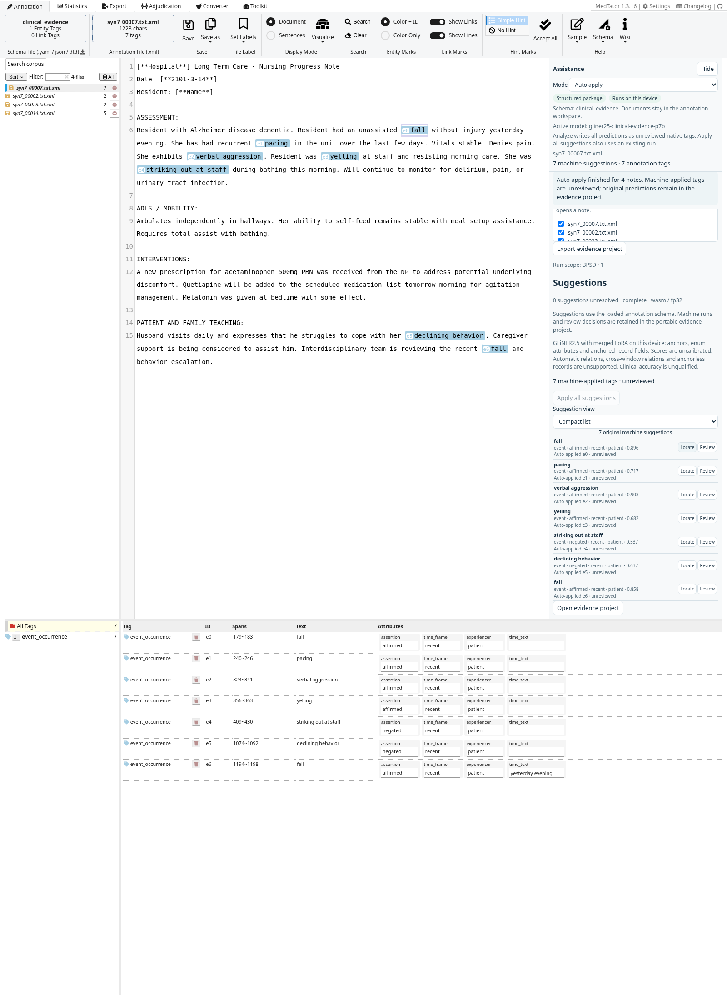
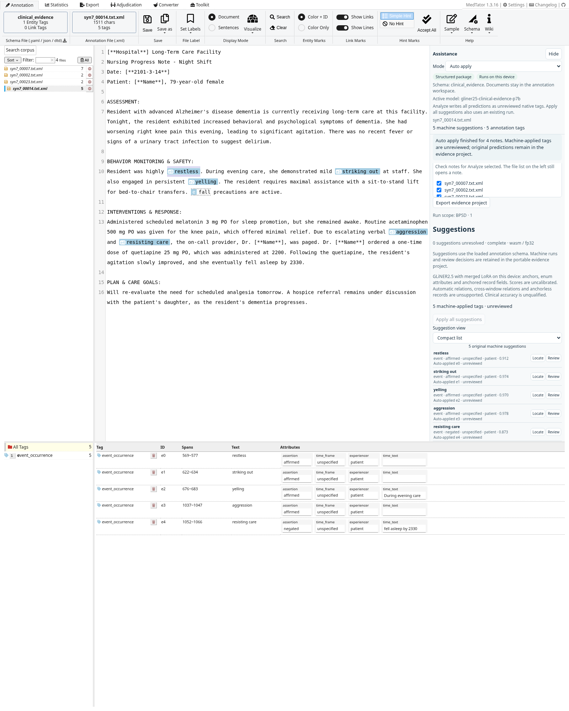
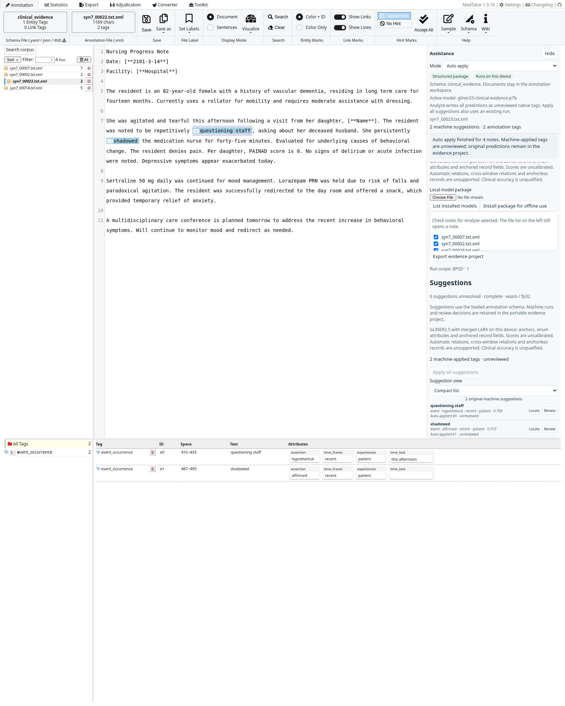

# P7b model replacement and validation

Superseded by [ClinicalEvidence v3/job 17089](V3-17089-VALIDATION.md); retained as an unchanged historical comparison.

NextMedTator's archived P7b clinical validation package is `gliner25-clinical-evidence-p7b`, replacing the P4 package in real-weight browser gates. Import this ZIP in the original annotation assistance panel, then optionally install it for offline use. The active package ID is shown in the panel header. Previously saved P4 runs preserve their original lineage. Private research weights remain outside Git and the public small-model catalog.

## Pinned model and model-card findings

- Adapter: [`na399/clinical-evidence-gliner2.5-lora-p7b`](https://huggingface.co/na399/clinical-evidence-gliner2.5-lora-p7b/tree/ac4b10b7d961bfa5ce79703fb2f689c2f93be261), revision `ac4b10b7d961bfa5ce79703fb2f689c2f93be261`.
- Base: `fastino/gliner2.5-base-v1@ca906247640776a07753514055be9726f9080ead`. The adapter metadata does not pin a base revision; we retain the same byte-verified revision as P4 for the controlled comparison.
- Rank 32, alpha 64, dropout 0.1; all 246 adapter tensors load exactly, including encoder and task heads. Active-adapter versus merged encoder maximum absolute error is 7.48e-6.
- Exported ZIP: 790,395,419 bytes, SHA-256 `72ed18e07d13c7a4e9618626b1ec69aaa02ee5c162c62b0fbe66fd7d3fbc0bc1`. Native numerical checks pass for all four graphs and six source cases; all 17 browser fixtures pass.
- The owner temporarily enabled a public download; all source files are cached locally. The card and LICENSE restrict use to the owner's research group and prohibit redistribution. We do not publish the adapter or merged ONNX weights.

The card describes the six clinical entity types and a **v2 positive-only attribute scheme**. Attribute spans such as `negated mention` must be joined to core spans on their character offsets; absence means a default in that source decoder. Its newer v3 explicit-axis scheme is not this adapter's training scheme. The card also reports that record-choice binding did not pass its qualification and recommends a separate hybrid decoder for choices.

Our browser keeps the existing anchored-record and choice-head codec, without implementing the ClinicalEvidence hybrid attribute-span path. Attribute and negation-cue work remains deferred. Numerical graph conformance does not qualify the displayed choice values: they are unreviewed, and screenshots retain incorrect values when the model produces them. The card's BPSD entity F1 of **0.84** is source-reported at its best tested threshold, with a different extraction protocol; it is not our browser metric.

## End-to-end validation

All 131 app unit tests and 11 standalone packager tests pass. Both static builds and the 5,078-asset inventory pass. Actual Chromium 151 / ORT Web 1.23.2 checks cover conformance, model read-back verification, offline installation/restart/inference, review, snapshot comparison, portable export/reopen, immutable model lineage, and native Vue/CodeMirror accept/reject annotations. The original-UI regression gate passes. No prediction is injected or corrected.

[Technical report](qualification/clinical-p7b-technical.json) records graph errors, adapter/base hashes and browser evidence.

## Controlled generated-note comparison

Results use the same 27 supplied synthetic nursing notes, 618 generated reference anchors, six-family schema, code-point multiset matching and threshold 0.5 as the archived P4 run. These unverified generated labels are not clinical ground truth or an independent held-out benchmark. The engineering workspace and original annotation UI are checked separately. Timing observations are cloud diagnostics, not target-device qualification or a speed comparison.

| Metric | P4 | P7b |
|---|---:|---:|
| Predictions / exact reference matches | 494 / 380 | 418 / 335 |
| Precision agreement | 76.9% | 80.1% |
| Recall agreement | 61.5% | 54.2% |
| Exact-anchor micro F1 agreement | 68.3% | 64.7% |
| Assertion agreement on matched labeled anchors | 76.0% | 62.6% |
| Experiencer agreement on matched labeled anchors | 50.7% | 65.1% |
| Time-frame agreement on matched labeled anchors | 70.9% | 66.1% |

P7b gives fewer predictions, higher precision and lower recall; F1 falls 3.7 percentage points under this existing app protocol. Attribute percentages use each model's own matched anchors and are diagnostic, not v2 hybrid qualification or a comparison on identical denominators. All seven generated negated-pain anchors are omitted by P7b, including the previously reported `Denies pain`; P4 detected one. No missing output is supplied by a heuristic.

All 27 engineering-workspace runs complete offline with full source coverage and valid offsets; portable corpus export/reopen preserves every source and machine run. The 17-choice status union still fails explicitly against the eight-choice head, rather than silently dropping choices.

All 27 notes also pass batch inference in the original annotation UI, yielding the same 418 predictions and 335 exact matches. Representative native Auto apply runs contain 17, 11, 18 and 24 tags; duplicate prevention, immutable source predictions, unreviewed provenance and portable evidence exports pass. The corpus screenshot selector records omissions when no successful negated-pain example exists, rather than assuming one or inventing a prediction.

[Original-UI corpus report](qualification/clinical-p7b-original-corpus-ui.json) · [Generated-note report](qualification/clinical-p7b-generated-notes.json) · [P4/P7b comparison](qualification/clinical-p7b-comparison.json)


## User-configured BPSD Auto apply

The BPSD profile is a freely entered user configuration, not a built-in narrow preset. It uses exactly the prior P4 definition, selected `event_occurrence` family and threshold 0.5. All four runs complete with exact source offsets. Each machine prediction is auto-applied to a native tag, remains unreviewed, and retains its original run/model identity. Portable exports retain scope, source and provenance. Every machine/native row fits in the captures; no outputs were removed or repaired.

| Supplied note | P4 tags | P7b tags | P7b screenshot |
|---|---:|---:|---|
| syn7_00007 | 7 | 7 | [View](qualification/p7b-bpsd-syn7_00007-auto.png) |
| syn7_00002 | 3 | 2 | [View](qualification/p7b-bpsd-syn7_00002-auto.png) |
| syn7_00023 | 2 | 2 | [View](qualification/p7b-bpsd-syn7_00023-auto.png) |
| syn7_00014 | 8 | 5 | [View](qualification/p7b-bpsd-syn7_00014-auto.png) |

The first note still contains two off-scope `fall` predictions and omits `resisting morning care`. The second includes `sundowning` and `outburst of end-stage agitation`; P4's `resting` prediction is absent. The third still returns only `questioning staff` and `shadowed`, demonstrating omissions. The dense note includes `restless`, `striking out`, `yelling`, `aggression` and `resisting care`, and removes P4's `fell asleep` and `re-evaluate` outputs. Several relevant anchors are still missing. The dense note also incorrectly labels `resisting care` as negated. Fewer tags do not establish better recall, and prompt exclusions remain guidance rather than a deterministic filter.

[Importable scope](qualification/p7b-bpsd-scope.json) · [Full report and predictions](qualification/p7b-bpsd-report.json) · [Scope editor](qualification/p7b-bpsd-scope-editor.png)







## Reproduce

Build the original app and engineering preview first. Download/export the pinned adapter using the [standalone packager instructions](../../tools/gliner-onnx/README.md). Use an authorized credential if the adapter has been made private again. The browser gates require actual weights and fail rather than silently skipping or substituting mock predictions.

```sh
NMT_LORA_PACKAGE=/path/to/clinical-p7b.nmt-model.zip uv run --locked python tests/browser/test_lora_model.py
NMT_LORA_PACKAGE=/path/to/clinical-p7b.nmt-model.zip uv run --locked python tests/browser/test_lora_samples.py
NMT_LORA_PACKAGE=/path/to/clinical-p7b.nmt-model.zip uv run --locked python tests/browser/test_lora_corpus_ui.py
NMT_LORA_PACKAGE=/path/to/clinical-p7b.nmt-model.zip uv run --locked python tests/browser/test_lora_bpsd.py
```
