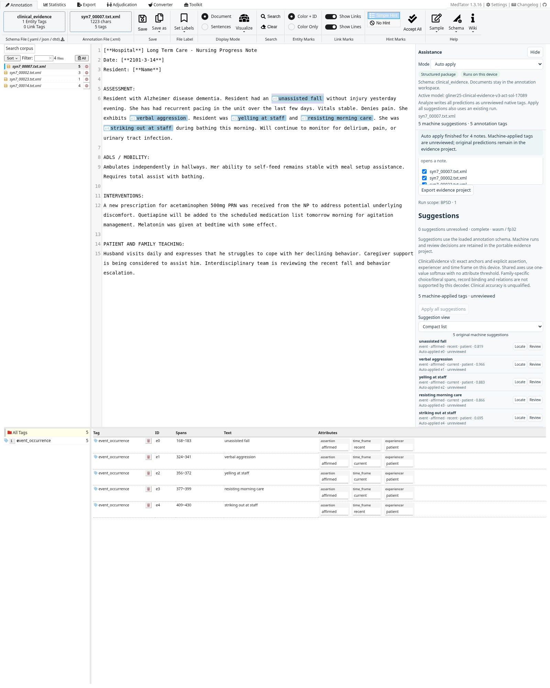
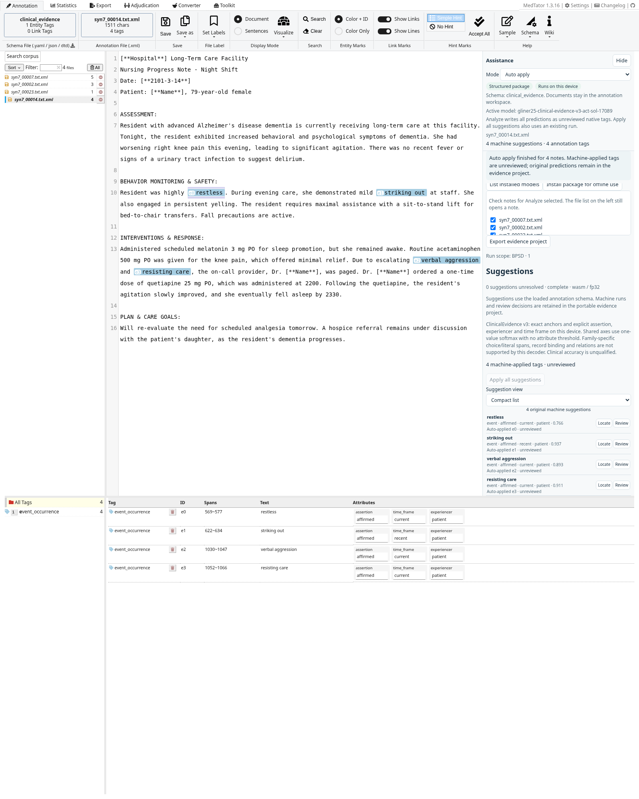
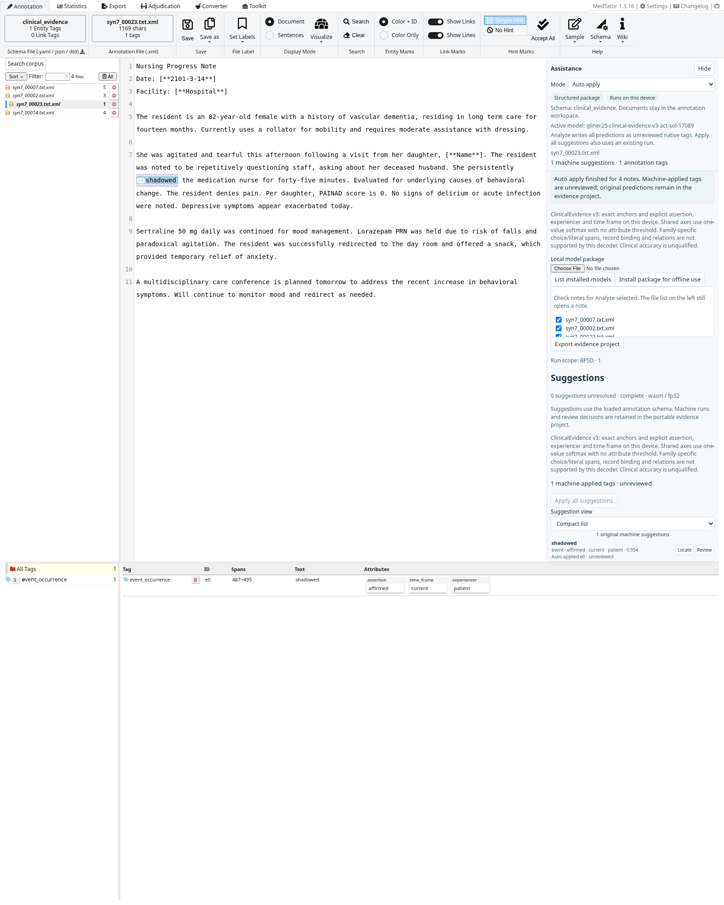

# ClinicalEvidence v3 ACT/Sol adapter, job 17089

Validated on 2026-10-06 in Chromium 151 / ORT Web 1.23.2 on Linux. The current local validation package is `gliner25-clinical-evidence-v3-act-sol-17089`, replacing [P7b](P7B-VALIDATION.md) in the default real-weight browser gates. Import the package in the original assistance panel and optionally install it for offline use. The public catalog does not distribute these research weights. Existing runs retain their prior model lineage and scope.

## Model-card findings and immutable identity

- [Adapter and model card](https://huggingface.co/na399/clinical-evidence-gliner2.5-lora-v3-act-sol-17089/tree/058945fb562f3c6250450ff67b842255f872ddf4), revision `058945fb562f3c6250450ff67b842255f872ddf4`.
- Phase 8/v3 relabeled natural ACT and synthetic Sol training; seed 42, selected epoch 4 from job 17089. This is an individual candidate, **not the final campaign winner**. ACT's protected test was excluded, Sol has no independent test, and BPSD informed earlier development. The card's full public benchmark results remain pending.
- The checkpoint-selection non-default micro F1 of 0.65202 at 0.5 is a validation result. The frozen extraction threshold is **0.6**, selected using validation only. Neither is a held-out browser/clinical qualification result.
- Base: `fastino/gliner2.5-base-v1@ca906247640776a07753514055be9726f9080ead`. The five cached core assets match the published frozen campaign hashes. This is a verified matching public reference, not evidence of the historical training resolver revision.
- Rank 32, alpha 64, dropout 0.1; encoder and extractive-head targets, with **no record-head training claim**. All 230 adapter tensors load exactly. Active-adapter versus merged encoder maximum absolute error is 6.44e-6. Export uses CPU FP32; it does not claim equality with the training runtime's CUDA/TF32 execution.
- Adapter weights SHA-256: `dccb3903ae909ed517076f262aa7399ad723b4c4b3828f9d112811862f49a0bf`. Config SHA-256: `fd286577f298db446a9946da32599302422ff0b91e5a6216c94620fd194c253a`.
- Exported ZIP: 790,603,065 bytes, SHA-256 `d5917c7a5e74ab5858d99d1eb3300067f31e8f7eb9f4e8bf5c1c2d2c63a5115a`.
- Private research use, no weight redistribution. Weights are cached outside Git; only metadata, reports and captures of the supplied synthetic text are committed.

The [technical report](qualification/clinical-v3-17089-technical.json) retains base/adapter/artifact hashes, frozen threshold provenance, the model-card study and browser conformance results. The actual installed GLiNER source commit matches the card's expected `55656fbfa01d3d4a77485e1a1eeeaf682990ccdf`.

## V3 decoding and scope behavior

`gliner25-clinical-v3-spans-v1` is a separate app-owned codec; existing packages keep their original codecs. It uses the card's six clinical-core labels and **verbatim descriptions**. Scope definitions/aliases are appended as user guidance. Broad presets remain broad; BPSD is a user-authored configuration.

The shared axes query the complete trained vocabularies using qualified labels, including `assertion: ruled out` and `time frame: historical`. Values map back to native `ruled_out` and `time_frame`. Each requested axis uses one-value softmax at the retained span, **without an attribute threshold**. Default values are explicitly queried, never inferred from an omitted axis. Native administrative choices such as `unspecified` and `not_applicable` remain available for manual annotation but are not model queries. Incomplete or foreign shared-axis vocabularies fail explicitly.

The model card treats family-specific literal and choice fields as separate span labels; it does not establish record-level binding. This decoder exposes core anchors and shared axes only. Its scope editor disables those other fields, and an old selected unsupported field can be unchecked before applying an old profile. It never runs the base record head to guess literal binding. The unused record/relation graphs are numerically checked for archive compatibility, not qualified for v3 inference. Cue highlighting remains deferred.

The original MedTator UI is retained. Fresh v3 presets use 0.6 and supported shared axes. Existing applied scopes and predictions are not silently rewritten. Runs preserve the actual inference-schema hash, model lineage, scope and limitations. The package's registry artifact is checked against app-owned prompts/mappings. A tokenizer regression discovered by the new source fixtures was fixed: embedded `[DESCRIPTION]` markers now receive the exact Hugging Face special-token IDs.

## Executed engineering gates

All **136 app unit tests** and **11 standalone packager tests** pass without skips. Both static builds and the 5,080-asset inventory pass, as does the original-UI regression gate. Native ONNX checks cover four graphs and eight source cases. All **21 ORT Web fixtures** pass, including exact v3 shared-axis outputs for negated pain, a family experiencer and a historical event.

Actual browser checks cover hash-verified model installation, offline restart/inference, review, snapshot comparison, portable export/reopen, immutable lineage, the private canary, and original Vue/CodeMirror accept/reject/export. Both the offline engineering workspace and original annotation UI process all 27 supplied notes with complete source coverage, valid code-point offsets and identical agreement results. Representative native Auto apply runs contain 15, 14, 13 and 22 tags; duplicate protection, unreviewed provenance and unchanged source predictions pass. No predictions are inserted or corrected and no note text leaves the app.

## User-adjustable extraction threshold

The original assistance panel and evidence workspace expose **Suggestion threshold** beside analysis. The v3 default stays 0.6; a user override can be any number from 0 to 1. **Use default** restores the applied scope or model default. This threshold applies to anchor extraction, while qualified shared axes continue to use their one-value softmax without an attribute threshold. Changes affect future analysis and Auto apply; existing runs and native tags are preserved. Every run records the effective threshold and whether it came from the user, scope, or model.

The focused real-ONNX browser gate changes a user-authored BPSD scope from 0.6 to 0.9: `syn7_00007` has five suggestions at 0.6 and one at 0.9. The two-note batch consistently uses 0.9. Its original run, frozen scope, corpus transport and portable export remain unchanged. Invalid values are rejected and the control is disabled while busy. The engineering workspace's source note changes from three to two suggestions. Editing and starting analysis with one click passes in both interfaces. These are extraction-control checks, not new accuracy metrics; the 27-note diagnostics below remain at 0.6.

[Threshold validation report](qualification/suggestion-threshold.json) · [Original UI at 0.6](qualification/suggestion-threshold-06.png) · [Original UI at 0.9](qualification/suggestion-threshold-09.png)

Reproduce the additional gate with `NMT_LORA_PACKAGE=/path/to/clinical-v3-17089.nmt-model.zip .venv/bin/python tests/browser/test_threshold.py` after building both interfaces. It requires real weights and runs the two browsers sequentially.

## Generated-reference diagnostics

The same 27 supplied notes contain 618 unverified generated reference anchors. The reference text/labels are unchanged. This is **not an independent clinical gold benchmark**. V3 uses a different prompt/attribute protocol and 0.6 threshold, so the following is not a controlled weights-only comparison. Attribute percentages use each model's own exact-matched, labeled anchors, with different denominators.

| Metric | Archived P4 at 0.5 | Archived P7b at 0.5 | V3 at 0.6 |
|---|---:|---:|---:|
| Predictions / exact matches | 494 / 380 | 418 / 335 | 409 / 331 |
| Precision agreement | 76.9% | 80.1% | 80.9% |
| Recall agreement | 61.5% | 54.2% | 53.6% |
| Exact-anchor micro F1 | 68.3% | 64.7% | 64.5% |
| Assertion agreement | 76.0% | 62.6% | 86.1% (284/330) |
| Experiencer agreement | 50.7% | 65.1% | 97.6% (121/124) |
| Time-frame agreement | 70.9% | 66.1% | 78.1% (89/114) |

V3's event-family exact-anchor recall agreement is only 34.8% (47/135). All seven generated negated-pain anchors are omitted in the full notes, including `Denies pain`; there is no overlapping replacement span. Passing the short source fixture does not establish long-note recall. Literal agreement is not scored because record-bound literals are unavailable.

[Generated-note report](qualification/clinical-v3-17089-generated-notes.json) · [Original-UI report](qualification/clinical-v3-17089-original-corpus-ui.json) · [Protocol-aware comparison](qualification/clinical-v3-17089-comparison.json)

## User-configured BPSD Auto apply

The same user-entered definition and four synthetic notes are retained. V3 now uses its verbatim event description, trained shared axes and frozen 0.6 threshold; prior captures used 0.5 with the old codec. Every prediction becomes an unreviewed native tag. All machine/native rows are visible, and portable exports preserve source, model and scope identities.

| Note | V3 tags | Actual anchors |
|---|---:|---|
| syn7_00007 | 5 | unassisted fall; verbal aggression; yelling at staff; resisting morning care; striking out at staff |
| syn7_00002 | 3 | sundowning; resting; restless |
| syn7_00023 | 1 | shadowed |
| syn7_00014 | 4 | restless; striking out; verbal aggression; resisting care |

The first note includes the excluded fall and omits pacing. The second includes resting. The third omits questioning staff and other relevant behavior. The dense note still omits yelling, though `resisting care` is now labeled affirmed. These are real outputs, not validated BPSD labels or deterministic scope membership.

[Importable scope](qualification/v3-act-sol-17089-bpsd-scope.json) · [Full predictions/report](qualification/v3-act-sol-17089-bpsd-report.json) · [Scope editor](qualification/v3-act-sol-17089-bpsd-scope-editor.png)

Reproduce using the pinned [standalone packager recipe](../../tools/gliner-onnx/README.md), then build the original app and engineering preview and run the four real-weight browser gates listed there. The gates require real weights and fail on errors rather than substituting mock predictions. Target-device, clinical-pilot and public-release acceptance gates remain unqualified.
