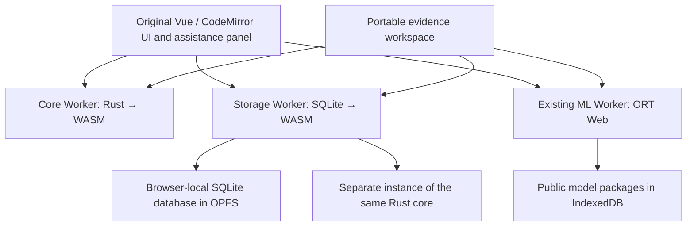

# Browser-local WASM backend

NextMedTator keeps the original MedTator Vue 2, CodeMirror 5, schema editor, file list, annotation table, statistics and adjudication screens. Python/Flask still renders static files at build time. There is no production server, account, remote SQL endpoint or inference service.



## Compute boundary

`wasm/core` implements schema/record/span/field/relation validation, code-point to UTF-16 conversion, literal matching and complete snapshot comparison, including deterministic maximum-cardinality matching, coverage exclusions, evidence and relation metrics. The comparison algorithm/version and canonical report hashes remain compatible with the JavaScript reference implementation. Iterative augmenting paths avoid recursive stack growth; document/family partitioning and a 20-million candidate-pair budget bound matching work. The original request tree must be canonical JSON data before serialization, so explicit undefined/non-finite values cannot be silently dropped or converted to null. Transport retains insertion order for report conformance. JSON requests are limited to 64 MiB and responses to 128 MiB; worker requests time out and queued operations are cancelled together.

The ABI exchanges UTF-8 JSON through explicit allocated buffers. Workers run the actual compiled Rust module. Browser project open/create/run validation and comparison use it; the storage worker independently validates every durable write/read through the same compiled core. TypeScript declarations describe the closed private protocol in `backend/protocol.d.ts`. JavaScript keeps UI orchestration, WebCrypto hashes, file formats, provenance and immediate single-record edit guards. The JavaScript comparison implementation remains a conformance reference and a DOM-only test adapter. Native Node contract tests also retain their reference validator. This is selective kernel migration, not a claim that every annotation operation is compiled.

## Durable state

The official pinned `@sqlite.org/sqlite-wasm@3.53.4-build2` package runs in a module worker using its OPFS VFS. The file is `/nextmedtator-v2.sqlite3` inside the origin's private filesystem. Tables index documents, annotation layers, relations, model runs, snapshots, decisions, review events, comparisons and original-screen child projects. The complete canonical native project is stored alongside these relational projections and remains the portable compatibility authority. Imported identifiers/values are bound SQL parameters; callers can request summary, paginated records and events, never arbitrary SQL.

Each checkpoint validates first, starts `BEGIN IMMEDIATE`, checks the expected prior hash, atomically replaces all project tables, verifies the canonical payload by reading it back, and commits. Foreign keys, `synchronous=FULL`, rollback journaling and `secure_delete=ON` are enabled. A failed statement or actual `SQLITE_FULL` leaves the prior project intact. A worker termination around commit can lose the acknowledgement even if the new transaction committed: reload the saved checkpoint before retrying; CAS refuses a stale write. Hashes detect corruption, not authenticated authorship or tamper-proof auditing.

Project Web Locks prevent two tabs from editing one recovery copy. A global write lock and SQLite transactions serialize database writes. Persistent initialization, including schema creation/migration for read-only first requests, takes that same lock before serving any operation; mutation locks are acquired afterward to avoid nested locking. Volatile corpus search does not take the persistent database lock. SQLite initialization, storage denial or unsupported OPFS must fail explicitly; a volatile in-memory database is never presented as saved recovery. Manual annotation and native/XML exports remain available when durable storage is unavailable.

## Original-screen recovery

In the existing assistance panel choose **Enable local corpus recovery** and accept the local-storage prompt. This stores the loaded corpus, schema, manual tags and native child-project histories. Vue edits trigger a debounced checkpoint; the panel distinguishes pending, saving, verified and failed states. The native child projects preserve model-run, snapshot, exposure and decision identities. Aggregate record IDs are namespaced to avoid collisions across notes. Duplicate filename/text identities are refused with a rename instruction rather than silently conflated. File System Access handles are excluded and must be reselected after restart.

After restarting, choose **List saved corpora**, then restore the chosen corpus. The original schema/file/editor screens are restored. Recovery remains opt-in. The evidence workspace retains its existing recovery controls and adds query inspection and SQLite export. Both screens can export a SQLite backup containing only the selected project, suitable for external SQLite inspection; use native `.nmt.zip` bundles for app-level portable import/restore. There is no arbitrary SQLite import or query console.

Existing `nextmedtator-recovery-v1` IndexedDB copies are listed separately in the evidence workspace. Explicit restore and enable verify their hash, copy the unchanged native project into SQLite, and retain the old copy for rollback. The old copy is a migration-time snapshot; later SQLite edits are not mirrored back. Export the current native bundle before rolling back to an older app. When SQLite/OPFS is unavailable, legacy checkpoints remain listed with a warning and can be restored in memory, exported and reopened. Recovery stays off; no volatile database is presented as persistent. Partial listing failures are isolated by store; if both stores fail the listing reports failure. No clinical project is migrated at startup or before consent. Model storage remains separate. Deletion removes logical app data; browser/OS backups and forensic erasure are outside this guarantee.

## Build and qualification

Install Rust 1.90.0 and the WASM target, alongside the existing pinned pnpm/uv tooling:

```sh
rustup toolchain install 1.90.0 --profile minimal --component rustfmt --target wasm32-unknown-unknown
pnpm install --frozen-lockfile
uv sync --locked
pnpm build:core
pnpm test
pnpm build
pnpm build:preview
pnpm audit:assets
uv run --locked python tests/browser/test_wasm_backend.py
uv run --locked python tests/browser/test_legacy_recovery.py
uv run --locked python tests/browser/test_recovery_faults.py
uv run --locked python tests/browser/test_review_fixes.py
```

Build commands compile the locked Rust crate and bundle core/SQLite WASM and worker assets locally. No clinical bytes reach a build tool. Serve through HTTPS or localhost with the generated CSP, COOP and COEP headers; `file://` is not a supported WASM/OPFS deployment. All backend assets participate in the hashed offline inventory. Cold installation needs the network for public assets; installed core/storage operate after network-blocked restart.

The added unit suite instantiates actual Rust and SQLite WASM, compares native-contract/report identity, and tests transactional rollback, actual full-database failure, SQL binding/pagination and cancellation. Chromium gates exercise actual OPFS, reload, original-UI autosave, migration with identical hashes, single-project exports verified by Python SQLite, unavailable storage, tab locks, CAS and offline reads/writes with request canaries. Existing real GLiNER2.5 ONNX qualification remains required; no fake inference runtime qualifies the model.

Target Mac/Windows browsers, clinician/assistive-technology acceptance, large-corpus/device performance and public deployment remain external qualification gates. The actual fine-tuned LoRA is still pending. Automatic relations for the published small ONNX export remain withheld for its documented source discrepancy. See `STATUS.md` and `QUALIFICATION.md`.

Rust dependencies are locked in `Cargo.lock`; their reproduced license texts ship in `THIRD-PARTY-NOTICES.txt`. SQLite's bundled license preamble is retained, including Emscripten MIT/NCSA notices and SQLite public-domain notices; the npm wrapper declares Apache-2.0.

## English corpus retrieval (FTS5)

**FTS retrieves; `medtator-core` decides.** Search is a candidate retrieval layer. It does not add annotations, assign phenotype/classification truth, alter frozen references, or replace deterministic CaseDistiller execution. There is no CaseDistiller-to-FTS rule compilation in this release.

On the original annotation screen choose **Search corpus** in the document pane. Search all entered words, an ordered phrase, word prefixes, or an advanced expression (`"suicide attempt" OR suicid*`). Results show BM25 ordering, plain-text snippets with highlighted matches, current annotation counts, and pages of 25 notes. Selecting a result opens the existing CodeMirror editor. Close search to return to the original file list and its sorting/filter controls. Only the loaded corpus is searched; notes are not sent to a service.

The worker uses FTS5 `unicode61`, without stemming, synonym expansion, trigram indexing, or Thai segmentation. Short English abbreviations such as MI/HF/DM remain searchable as whole tokens. English case folding and diacritic matching are retrieval behavior, not exact lexical/rule semantics. BM25 statistics belong to the FTS table; project-scoped filters constrain returned documents. Ranking and snippets must never be interpreted as annotation offsets or classification evidence.

Live search uses a separate in-memory SQLite worker with OPFS VFS initialization disabled. Indexing starts with a query; closing search terminates the worker. Corpus edits, imports, renames and removals invalidate the index/results and trigger a transactional rebuild for the next query. Revision and request checks discard superseded answers and refuse opening stale source copies. This live index is independent of recovery consent. With unavailable WASM, close search and continue using the original file list.

Durable recovery schema v3 adds `document_fts`, an external-content index over `document_search_content`, a view reading the existing canonical document JSON. It stores no additional full durable text column. Insert/update/delete triggers synchronize the index inside the same checkpoint transaction. Opening a previously opted-in v2 recovery database creates and rebuilds the index transactionally without changing native project hashes. The OPFS filename remains `/nextmedtator-v2.sqlite3` to preserve existing recovery copies. Single-project SQLite exports include a freshly populated FTS index. Older apps reject schema v3; export the native bundle before rollback.

`StorageBackend.search({projectId,query,mode,limit,offset})` exposes only bound queries. Results include document IDs, source hashes, finite ranks and plain-text snippet segments; the UI creates text nodes and `<mark>` elements, never trusts HTML from note text. Invalid advanced expressions report a search error. The volatile API additionally requires the indexed revision and exposes `indexCorpus`; raw SQL and dynamic schema names are not accepted.

Qualification commands:

```sh
uv run --locked python tests/browser/test_corpus_search.py
node scripts/benchmark_search.mjs
```

The benchmark uses 1,000 synthetic English clinical-style notes (~7.2 MB of text), records build/full-refresh and query timings, and compares SQLite database size against the same content table without FTS. It writes `test-results/search-benchmark.json`; this is not a real clinical corpus or target-device qualification. Browser gates exercise real SQLite-WASM, phrase/prefix/short-token search, safe snippet rendering, paging, add/edit/rename/remove synchronization, stale responses, no OPFS persistence before consent, recovery-backed FTS, and an installed offline restart. Thai/trigram search, structured annotation filters, saved queries and CaseDistiller candidate-review workflows remain future work.
