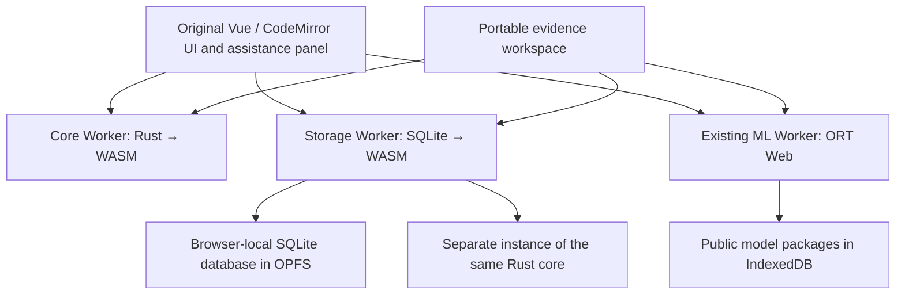

# Browser-local WASM backend

NextMedTator keeps the original MedTator Vue 2, CodeMirror 5, schema editor, file list, annotation table, statistics and adjudication screens. Python/Flask still renders static files at build time. There is no production server, account, remote SQL endpoint or inference service.



## Compute boundary

`wasm/core` implements schema/record/span/field/relation validation, code-point to UTF-16 conversion, literal matching and complete snapshot comparison, including deterministic maximum-cardinality matching, coverage exclusions, evidence and relation metrics. The comparison algorithm/version and canonical report hashes remain compatible with the JavaScript reference implementation. Iterative augmenting paths avoid recursive stack growth; document/family partitioning and a 20-million candidate-pair budget bound matching work. JSON requests are limited to 64 MiB and responses to 128 MiB; worker requests time out and queued operations are cancelled together.

The ABI exchanges UTF-8 JSON through explicit allocated buffers. Workers run the actual compiled Rust module. Browser project open/create/run validation and comparison use it; the storage worker independently validates every durable write/read through the same compiled core. TypeScript declarations describe the closed private protocol in `backend/protocol.d.ts`. JavaScript keeps UI orchestration, WebCrypto hashes, file formats, provenance and immediate single-record edit guards. The JavaScript comparison implementation remains a conformance reference and a DOM-only test adapter. Native Node contract tests also retain their reference validator. This is selective kernel migration, not a claim that every annotation operation is compiled.

## Durable state

The official pinned `@sqlite.org/sqlite-wasm@3.53.4-build2` package runs in a module worker using its OPFS VFS. The file is `/nextmedtator-v2.sqlite3` inside the origin's private filesystem. Tables index documents, annotation layers, relations, model runs, snapshots, decisions, review events, comparisons and original-screen child projects. The complete canonical native project is stored alongside these relational projections and remains the portable compatibility authority. Imported identifiers/values are bound SQL parameters; callers can request summary, paginated records and events, never arbitrary SQL.

Each checkpoint validates first, starts `BEGIN IMMEDIATE`, checks the expected prior hash, atomically replaces all project tables, verifies the canonical payload by reading it back, and commits. Foreign keys, `synchronous=FULL`, rollback journaling and `secure_delete=ON` are enabled. A failed statement or actual `SQLITE_FULL` leaves the prior project intact. A worker termination around commit can lose the acknowledgement even if the new transaction committed: reload the saved checkpoint before retrying; CAS refuses a stale write. Hashes detect corruption, not authenticated authorship or tamper-proof auditing.

Project Web Locks prevent two tabs from editing one recovery copy. A global write lock and SQLite transactions serialize database writes. SQLite initialization, storage denial or unsupported OPFS must fail explicitly; a volatile in-memory database is never presented as saved recovery. Manual annotation and native/XML exports remain available when durable storage is unavailable.

## Original-screen recovery

In the existing assistance panel choose **Enable local corpus recovery** and accept the local-storage prompt. This stores the loaded corpus, schema, manual tags and native child-project histories. Vue edits trigger a debounced checkpoint; the panel distinguishes pending, saving, verified and failed states. The native child projects preserve model-run, snapshot, exposure and decision identities. Aggregate record IDs are namespaced to avoid collisions across notes. Duplicate filename/text identities are refused with a rename instruction rather than silently conflated. File System Access handles are excluded and must be reselected after restart.

After restarting, choose **List saved corpora**, then restore the chosen corpus. The original schema/file/editor screens are restored. Recovery remains opt-in. The evidence workspace retains its existing recovery controls and adds query inspection and SQLite export. Both screens can export a SQLite backup containing only the selected project, suitable for external SQLite inspection; use native `.nmt.zip` bundles for app-level portable import/restore. There is no arbitrary SQLite import or query console.

Existing `nextmedtator-recovery-v1` IndexedDB copies are listed separately in the evidence workspace. Explicit restore and enable verify their hash, copy the unchanged native project into SQLite, and retain the old copy for rollback. The old copy is a migration-time snapshot; later SQLite edits are not mirrored back. Export the current native bundle before rolling back to an older app. No clinical project is migrated at startup or before consent. Model storage remains separate. Deletion removes logical app data; browser/OS backups and forensic erasure are outside this guarantee.

## Build and qualification

Install Rust 1.90.0 and the WASM target, alongside the existing pinned pnpm/uv tooling:

```sh
rustup toolchain install 1.90.0 --profile minimal --component rustfmt --target wasm32-unknown-unknown
pnpm install --frozen-lockfile
uv sync --locked
pnpm build:core
pnpm test
pnpm build
pnpm build:preview
pnpm audit:assets
uv run --locked python tests/browser/test_wasm_backend.py
uv run --locked python tests/browser/test_legacy_recovery.py
uv run --locked python tests/browser/test_recovery_faults.py
```

Build commands compile the locked Rust crate and bundle core/SQLite WASM and worker assets locally. No clinical bytes reach a build tool. Serve through HTTPS or localhost with the generated CSP, COOP and COEP headers; `file://` is not a supported WASM/OPFS deployment. All backend assets participate in the hashed offline inventory. Cold installation needs the network for public assets; installed core/storage operate after network-blocked restart.

The added unit suite instantiates actual Rust and SQLite WASM, compares native-contract/report identity, and tests transactional rollback, actual full-database failure, SQL binding/pagination and cancellation. Chromium gates exercise actual OPFS, reload, original-UI autosave, migration with identical hashes, single-project exports verified by Python SQLite, unavailable storage, tab locks, CAS and offline reads/writes with request canaries. Existing real GLiNER2.5 ONNX qualification remains required; no fake inference runtime qualifies the model.

Target Mac/Windows browsers, clinician/assistive-technology acceptance, large-corpus/device performance and public deployment remain external qualification gates. The actual fine-tuned LoRA is still pending. Automatic relations for the published small ONNX export remain withheld for its documented source discrepancy. See `STATUS.md` and `QUALIFICATION.md`.

Rust dependencies are locked in `Cargo.lock`; their reproduced license texts ship in `THIRD-PARTY-NOTICES.txt`. SQLite's bundled license preamble is retained, including Emscripten MIT/NCSA notices and SQLite public-domain notices; the npm wrapper declares Apache-2.0.
